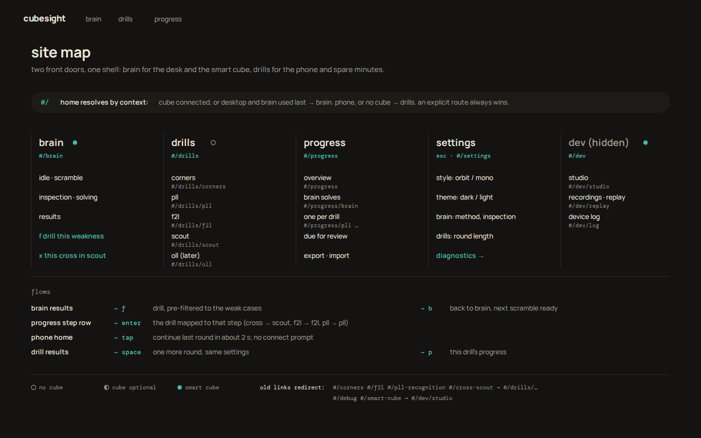

# Trainers & site structure

**Question:** where do the standalone trainers go now that Brain is becoming the
main product and the home of the site?

**Answer, in short:** the site gets two front doors that share one shell.

- **Brain** is the desk context: a smart cube, long sessions, a keyboard.
- **Drills** are the phone context: no cube, two spare minutes, one tap to play.

`#/` resolves to whichever door fits the device and whether a cube is
connected. The two doors share one top bar, one set of key conventions, one
results pattern and one **progress** page. Brain's results suggest the drill
that fixes today's weakness, pre-filtered to the weak cases, and the drill
hands you back to Brain afterwards.

Open `../index.html#trainers` for the frames. Each SVG has a PNG render next to
it, and every render was checked automatically for overlapping and clipped
text (see [Regenerating](#regenerating)).

---

## 1. What exists today

Seen by running the app (`vite --port 5192`, every route in dark and light) and
by reading each module.

| trainer | route | modules | trains | input | smart cube | keys today | stored in |
|---|---|---|---|---|---|---|---|
| Corner recognition | `#/corners` (current default) | `main.js`, `corner-view.js`, `glance-pacing.js`, `learning.js`, `recognition-profile.js` | naming the hidden sticker of a corner seen from varied angles; single, three corners, one-glance recall; optional adaptive glance (25 ms – 1.5 s); open practice or a 10-answer sprint | click or key | no | `w y g b r o` or `1–6` answer, `s` skip, `n` next (recall) | `cubesight-progress-v2`, `cubesight-learning-v1` |
| F2L deduction | `#/f2l` | `main.js`, `f2l-logic.js`, `f2l-planner.js`, WASM core | finding deducible pairs on a limited view; timed scan (15/30/45 s, optional pseudo pairs); best next pair (ergonomic planner) | click pieces | no | `n` new case, `s` start scan | `cubesight-learning-v1` (`f2l\|…` items), `cubesight-f2l-scan-seconds`, `cubesight-f2l-scan-pseudo` |
| PLL recognition | `#/pll-recognition` | `pll-trainer.js`, `pll-logic.js` | calling all 21 PLLs from a fixed two-sided view; learn (one family) / mix / transfer (random AUF, 24 h retention); optional glance | click or key | no (the header comment anticipates smart-cube state later) | a key per case from `1234567890qwerty…`, `s` skip, `enter` next | `cubesight-pll-progress-v1`, `cubesight-pll-glance-ms`, `cubesight-pll-glance-enabled` |
| Cross Scout | `#/cross-scout` | `cross-scout.js`, `cross-solver.js` (+ worker, WASM) | comparing cross / x-cross / xx-cross plans for a scramble; retrieval practice ("find the pieces, then reveal") | paste a scramble, click | optional: follows your turns along a plan and suggests recovery moves | none | `cubesight-scout-practice-v1`, `cubesight-scout-colors` |
| Brain | `#/brain` | `brain.js`, `solve-*.js`, `smart-cube-*.js` | full solves with live phase tracking, coach and metrics | smart cube | required | none yet (v2 adds `space`, `r`, `esc`, …) | `cubesight-solves-v1`, `cubesight-brain-*` |
| Debug (Smart Cube Studio) | `#/debug` (`#/smart-cube` redirects) | `smart-cube-studio.js` | nothing; it is a diagnostic space: raw events, gyro, tracked state, scramble rehearsal | smart cube | required | none | `cubesight-smartcube-mac-name`, `smartcube-ble-mac:*` |

Also relevant:
- `data-port.js` already exports and imports every `cubesight-*` and
  `smartcube-ble-mac:*` key. New keys that follow that prefix travel with a
  backup for free.
- `solve-metrics.js` already has `weakCases(records, 'pllCase' | 'ollCase')`,
  `phaseSplits` and `trimmedAverage`, which covers most of the "detect a weakness" work.
- Today every trainer has its own "Training settings" card, its own progress
  section and its own look. That, not the trainers themselves, is what makes
  them feel bolted on.

## 2. Two contexts, both first-class

| | **Brain: the desk** | **Drills: spare minutes** |
|---|---|---|
| device | laptop or desktop, a smart cube over Bluetooth | mostly a phone; a desktop tab also works |
| session | 20–60 min, many solves | 1–3 min, "one more round" |
| setup | connect, sync, scramble | none: open the site, tap once, drill within about 2 s |
| input | the cube, plus the keyboard | thumb or keyboard |
| cube chip | always visible (it is the input) | hidden unless the drill can use a cube |
| home | `#/brain` | `#/drills` (on the phone: the drills tab) |

The IA has to make both feel native. The design choices below follow from that.

## 3. Two IA options

### Option A: everything is a Brain mode (monkeytype modes)

The drills become modes on Brain's config line, next to the method settings, the
way monkeytype has `time · words · quote · zen`: `solve · corners · pll · f2l ·
scout`. There is one page. Progress is Brain's history with a mode filter.

- **+** Maximally unified: one screen, one config line, no hub to maintain.
- **+** Switching from a solve to a PLL drill is a single keystroke.
- **−** It conflates the two contexts. The phone user who wants a corner round
  lands on a smart-cube screen and has to find a mode switch first.
- **−** Brain's config line is already full (method, cross, pairs, OLL, PLL,
  inspection, penalties). Each drill brings its own settings (glance, family,
  round length), so the line would change meaning per mode.
- **−** Cube-free drills inherit a cube-first shell: a device chip, connect
  prompts and inspection settings that mean nothing to them.

### Option B: two front doors, one shell (recommended)

Top-level nav is `brain · drills · progress`. `#/` resolves by context. The drills
share Brain's shell, key conventions and results pattern, but they are not
inside Brain.

- **+** Each context gets a native home: the desk opens on Brain, the phone on drills.
- **+** The hub gives drills room for "for you" suggestions, review queues and
  quick-round presets. None of that fits on a config line.
- **+** Contextual jumps (Brain results → drill → back) still make it feel like
  one product.
- **−** There are two landing screens to keep consistent, plus a small resolver.
- **−** Slightly more navigation surface: a hub page, and bottom tabs on phones.

**Recommendation: B.** It borrows A's best idea: inside a drill the settings
are a monkeytype config line, exactly like Brain's (`T-03`). A drill looks like
a Brain mode even though it lives at its own route.

## 4. Site map and routes



| route | page | notes |
|---|---|---|
| `#/` | context home | see the resolver below; `replaceState` to the resolved route so Back works |
| `#/brain` | Brain | the smart-cube solve trainer (v2 designs) |
| `#/drills` | drills hub | `T-01`; on phones this is the "drills" tab |
| `#/drills/corners` | corner recognition | query: `mode=single\|three\|recall`, `round=2m\|10\|open`, `glance=300` |
| `#/drills/pll` | PLL recognition | query: `mode=learn\|mix\|transfer`, `cases=Ga,Gb,Gc,Gd,Aa` or `family=G`, `round=20` |
| `#/drills/f2l` | F2L deduction | query: `drill=deduction\|scan\|planner`, `pseudo=1`, `round=30s` |
| `#/drills/scout` | Cross Scout | query: `scramble=<moves>`, `colors=w` |
| `#/drills/oll` | (later) OLL recognition | a reserved slot, because Brain already stores `ollCase` |
| `#/progress` | unified progress | `T-05`; `#/progress/brain`, `#/progress/pll` … filter the same page |
| `#/settings` | settings | also an overlay on `esc` (`tab` in Mono); the route exists for phones and deep links |
| `#/dev`, `#/dev/studio`, `#/dev/replay`, `#/dev/log` | developer area | not in the nav; see §10 |

Any drill route can also carry `from=brain:<solve-at>`. It turns on the "← brain"
pill and the `b` key, and it tells the drill's results to report back (§5).

**Home resolver for `#/`**, first match wins:
1. The last explicit choice on this device (`cubesight-shell-v1.home`), if the user set one in settings.
2. A smart cube is connected, or was connected in the last session and Web Bluetooth is available → `#/brain`.
3. Coarse pointer and narrow viewport (a phone), or no Web Bluetooth → `#/drills`.
4. Otherwise (a desktop without a cube) → `#/brain`, which shows its connect state plus a quiet "no cube? try a drill" line.

**Backwards-compatible redirects** use `history.replaceState`, like the current `#/smart-cube` redirect:

| old | new |
|---|---|
| `#/corners` | `#/drills/corners` |
| `#/f2l` | `#/drills/f2l` |
| `#/pll-recognition` | `#/drills/pll` |
| `#/cross-scout` | `#/drills/scout` |
| `#/debug`, `#/smart-cube` | `#/dev/studio` |
| unknown hash (today falls back to corners) | `#/` (the resolver) |

`main.js` currently matches whole hashes (`TOOL_ROUTES`). It needs a small parser
for `#/<area>/<page>?<query>`. That parser is the only routing change.

## 5. How drills are reached

1. **Nav:** `drills` in the top bar (desktop) or the drills tab (phone).
2. **Hub** (`T-01`, mobile `T-07` left):
   - A **"for you"** block with three suggestions and why, keyed `1–3`.
   - A **table of drills**, one letter each (`c p f x`), showing what each trains,
     its modes, whether it needs a cube, your 30-day level with a trend, and
     how many items are due for review.
   - `enter` starts the selected drill's **quick round** preset.
3. **Contextual from Brain results** (`T-02`):
   - The coach states the evidence, e.g. "Across this session G perms cost you
     most: 1.9 s pause, others 0.6 s".
   - Under **fix next**, the matching drill is one key away, pre-filtered:
     `f` opens `#/drills/pll?cases=Ga,Gb,Gc,Gd,Aa&round=20&from=brain:…`.
   - `x` opens this scramble's cross in Cross Scout.
   - No more than two suggestions, and only when the signal is solid (see the table below).
4. **Back to Brain** (`T-03`, `T-04`):
   - While a drill runs, the top bar shows a `← brain · solve 23` pill, and `b` goes back.
   - The drill's results show "back in brain" with the before-number, and a
     primary **back to brain** button with the next scramble ready.
   - Brain then watches the next solves that hit the drilled cases and reports
     the change: "G-perm pause 1.9 → 0.9 s since your drill".
5. **From progress** (`T-05`): the "where your time goes" rows map each solve
   step to its drill (cross → scout, f2l → f2l deduction, pll → pll). `enter`
   on a row opens that drill.
6. **From the phone home** (`T-07`): a big **continue** button resumes the last
   drill with its last settings. A "from your last brain session" line carries
   Brain's suggestion over to the phone.

**Weakness signals → drill.** Each row gets a minimum-evidence rule, so a
suggestion never comes from a single solve.

| signal (source) | available today? | drill + pre-filter |
|---|---|---|
| slow PLL on specific cases: `weakCases(records, 'pllCase')`, `phases.pllMs` (`cubesight-solves-v1`) | yes | pll · `cases=<the weak ones>` |
| pause before PLL (recognition), per case | needs a new solve field such as `pllPauseMs`; add it to `cleanRecord` (an additive field, not a migration) | pll · `cases=…`, glance off |
| cross longer than optimal (`crossHindsight`, `moveCount` vs solver) | yes, per solve | scout · `scramble=<this one>` |
| long pauses between F2L pairs (coach "0.9 s pause finding it") | partly (the coach computes it live; it is not stored) | f2l · `drill=scan` (with `pseudo=1` if you use pseudo pairs) |
| weak OLL cases (`weakCases(…, 'ollCase')`) | yes | oll (later); until then the coach only names the cases |
| items due in the review queues (`learning-v1`, `pll-progress-v1`) | yes | corners / f2l / pll review round |

## 6. The shared shell

Mockups: `T-06` (the top bar in every state), plus every other frame.

- **Top bar:** `cubesight · brain · drills · progress` on the left. On the right:
  context (the cube chip, or a back pill, or nothing). No per-trainer title
  bars, eyebrows or "Training settings" cards.
- **Device chip rules:**

  | page | chip |
  |---|---|
  | Brain, Studio | always: dot, name, battery (it is the live input) |
  | a drill that can use a cube (Scout), cube connected | full chip |
  | the same drill, no cube | a quiet `◐ connect cube · optional`; never a modal |
  | a drill that doesn't use a cube, cube connected | dimmed chip (so you know it's still paired) |
  | a drill that doesn't use a cube, no cube | nothing at all, and no connect prompt |
  | phone home | nothing; the brain tab shows the cube state |

- **Style and mode:** the drills inherit `data-brain-style` (orbit | mono) and
  `data-theme` (dark | light) from the same settings. The `--b-*` tokens in
  `../tokens.md` apply unchanged. Rename the root class from `.brain` to a
  shell-level class (e.g. `.cs-shell`) so drills can use the tokens too.
  Proven in `T-light-*` and `T-mono-*`.
- **Settings:** one settings page with sections: *appearance* (style, theme), *brain*
  (method, inspection, penalties, coach), *drills* (round length, glance
  defaults, sounds), *data* (export, import, clear), and *diagnostics* (→ dev area).
  Each drill's own options live on its config line (the monkeytype line), not in a card.
- **Key conventions** (shown in the keycap hint bar at the bottom of every desktop page):

  | key | everywhere | Brain | drills |
  |---|---|---|---|
  | `space` | primary: go, next | next scramble | one more round |
  | `enter` | accept the focused suggestion | | next case (after an answer), start a quick round from the hub |
  | `esc` (`tab` in Mono) | settings / command line | | |
  | `s` | | share | skip the case |
  | `r` | retry | retry this scramble | retry the misses |
  | `b` | back to Brain (when you came from it) | | |
  | `f` / `x` | | drill this / open in scout | |
  | `p` | this drill's progress | | |
  | answers | | | corners `w y g b r o` / `1–6`; PLL `1–N` on a filtered set (renumbered), the case key on the full set |

- **Results pattern (Brain and every drill share it):**
  1. The big number on the left in accent (time, or median recognition), with
     four secondary numbers under it.
  2. A breakdown in the middle: splits for Brain, per-case bars against "before
     this round" for drills.
  3. A ring or donut on the right: step arcs for Brain, one arc per case for drills
     (fast = accent, slow = cream in Orbit or error in Mono, miss = DNF red).
  4. The lower half: coach or confusions, spaced review, and the next action.
  5. The keycap hint bar.
- **The ring is shared.** In a drill it becomes the round's progress, one arc per
  case (`T-03`). In a timed round it drains like inspection (`T-07`). Mono uses
  its lane instead (`T-mono-03`).

## 7. Quick drills: the mini-game mode

This mode is designed for the phone and two spare minutes (`T-07`, `T-08`).

- **Zero setup:** open the site on a phone and it goes to drills. The
  **continue** button replays your last drill and settings. There is no connect
  prompt and no cube chip. You are drilling within about 2 s: the drill modules
  are lazy-loaded, so prefetch the last-used one on idle.
- **Round types:** each drill has one preset, all changeable on its config line.

  | drill | quick-round preset |
  |---|---|
  | corners | timed, 2 min |
  | PLL | 20 cases |
  | F2L | 30 s scan, which already exists as "timed scan" |
  | Scout | open (it is an explorer; its retrieval practice counts as a round) |

  Corners' existing "10-answer sprint" becomes the "10 cases" option.
- **During a round:**
  - Instant feedback: a check or a cross, with the time.
  - A **combo** counter that resets on a miss.
  - Dots for the last 10 answers.
  - The ring (Orbit) or lane (Mono) is the clock or the case counter.
  - The top bar shrinks to `×`, the round name, and time or case left.
- **Tiny results card:**
  - correct out of total, median, the change vs last week, accuracy, best
    combo (with a "new best" spark);
  - every answer as a bar;
  - the slowest case, "12 more due in 3 h", and the streak kept;
  - one big **one more round** button, plus *change drill* and *done*.
- **Remember where you left off:** the last drill, its settings and a
  half-finished round are kept in `cubesight-shell-v1`, so the next open resumes
  them.
- **Streaks:** a day streak counts any round or any Brain solve (the top-right
  of the phone home). It is kept deliberately gentle: no loss screens.

## 8. One progress page

`T-05` (desktop) and `T-08` right (phone): one page across Brain and every drill,
filterable by source and period.

- **Brain:** the ao12 trend, the PB, the solve count.
- **Where your time goes:** Brain's average split per step, each mapped to its
  drill, with the biggest gap highlighted.
- **Drills:** rounds, median with a trend, accuracy, and due items for each drill.
- **Due for review:** one total across every review queue, with a **review now** button.
- **Activity:** a heatmap of solves plus drill cases per day.
- **Data:** export and import (the existing `data-port.js`).

**Keep every existing key and add a read-only adapter, not a migration.** A new
module (for example `src/progress-sources.js`) reads each existing key with its
existing loader and normalises it for the progress page. The writers don't
change.

| existing key | written by | shape (today) | feeds |
|---|---|---|---|
| `cubesight-solves-v1` | Brain (`solve-store.js`) | `{version:1, records:[{at, solveMs, moveCount, tps, phases{crossMs,f2lMs,ollMs,pllMs}, pllCase, ollCase, xcross, rotations, detours, mistakes, solved, …}]}` (capped) | Brain trend, ao5/ao12/PB, step split, weak PLL/OLL cases, activity |
| `cubesight-progress-v2` | corners (`main.js`) | `{attempts, correct, totalMs, bestMs, streak, bestStreak, byCase{family}, history[≤1000]{at, ms, correct, family, mode, glance, exposureMs, skipped, …}}` | corner median, accuracy, weak families, activity (it has timestamps) |
| `cubesight-learning-v1` | corners + F2L (`learning.js`) | `{version:1, trial, recentKeys, items{"corner\|…"\|"f2l\|…": {attempts, correct, streak, times[], lastSeen, due, dueTrial, …}}}` | due-for-review counts; F2L accuracy and times (F2L has no other history) |
| `cubesight-pll-progress-v1` | PLL (`pll-trainer.js`) | `{<case>: {attempts, correct, times[≤80], confusion{}, transfer{}, delayed{}, lastSeen, nextReviewAt, …}}` | per-case median and accuracy, confusions, due PLLs, weak-case pre-filter |
| `cubesight-scout-practice-v1` | Scout | `[{face, stage, cue, durationMs, rating, at}]` (≤60) | plans found / missed, activity |
| `cubesight-theme`, `cubesight-brain-*`, `cubesight-f2l-scan-*`, `cubesight-pll-glance-*`, `cubesight-scout-colors` | each module | settings | settings page (read in place, not copied) |
| `cubesight-smartcube-mac-name`, `smartcube-ble-mac:*`, `cubesight-recording*` | device, recorder | device cache, recordings | dev area only |

Only two new keys are needed, and both are additive:
- **`cubesight-shell-v1`:** home preference, the last drill and its settings, a
  half-finished round, and the day streak.
- **`cubesight-rounds-v1`:** a short summary per finished round:
  `{drill, at, n, correct, medianMs, cases[], from}`, capped at about 500.
  PLL and F2L keep no per-attempt timeline today, so round history and
  activity for them start from here. Their existing aggregates still show from
  day one.

Both use the `cubesight-` prefix, so `data-port.js` already backs them up.

## 9. Smart cube: needed, optional, or not at all

| | corners | PLL | F2L | Scout | Brain | Studio |
|---|---|---|---|---|---|---|
| cube | no | no (later: could read the real case from the cube) | no | optional (follows your turns along a plan) | required | required |

How it is shown:
- One glyph everywhere: `○ no cube`, `◐ cube optional`, `● smart cube`. It appears
  in the hub table, the phone list (only the `◐` is drawn there; no glyph means
  no cube) and the site map.
- The top-bar chip follows the rules in §6.
- Brain without a cube shows its own connect state, plus a "no cube? try a
  drill" line that goes to the hub.

## 10. Debug / Studio: the developer area

- It moves out of the main nav to `#/dev/studio`, next to `#/dev/replay`
  (recording replay, which today is harness-only) and `#/dev/log` (the
  connection log from `smart-cube-bluetooth.js`).
- It is reached from **settings → diagnostics**, from a long-press or
  right-click on the cube chip ("diagnostics…"), or by typing the URL.
- Its top bar carries a `dev` tag in the warn colour and a "← back to the app" link (`T-06` h).
- `#/debug` and `#/smart-cube` redirect there.

## 11. Naming

- **"drills"** for the section and the nav item.
  - "Trainers" is ambiguous, because Brain is a trainer too.
  - "Practice" is vague, and the old UI already uses it for everything ("Practice / Corners").
  - "Drills" says short, focused and repeatable, which is exactly the mini-game mode.
- **"progress"** replaces "history" in the nav, because it covers more than
  Brain's solve history. It sits next to "drills" as a noun about you.
- Drill names are lowercase in the new language and describe the skill:
  *corner recognition*, *pll recognition*, *f2l deduction*, *cross scout*.
  Keep "Cross Scout" as a proper name in prose.
- Inside a drill, a **round** is one session of N cases or T seconds, and a
  **case** is one question.

## 12. Phased rollout

| phase | what | touches |
|---|---|---|
| **1 · now, with Brain v2** | New top bar (`brain · drills · progress`) and the route parser. Redirects for the old hashes. `#/` resolver. Debug moves to `#/dev/studio`, out of the nav. The drills hub as a plain list (no "for you" yet). Drills keep their current UIs inside the new top bar. | `main.js` header and routing only |
| **2 · shared shell** | Promote the `--b-*` tokens to shell level. Re-skin the PLL drill first (it is the smallest and self-contained), then corners, F2L and Scout: config line, ring/lane, results pattern, hint bar. `cubesight-rounds-v1` and quick-round presets. The phone home and bottom tabs. | the drill modules' render layers; logic untouched |
| **3 · contextual loop** | Weakness signals on Brain results (`f` / `x`), `from=brain` and the `b` return, "back in brain" follow-up, the PLL `cases=` filter (today there is only a family filter), Scout `scramble=`, and the `pllPauseMs` solve field. | `brain.js`, `solve-coach.js`, `pll-trainer.js`, `cross-scout.js`, `solve-store.js` (additive) |
| **4 · progress** | `progress-sources.js` adapter, `#/progress`, due-for-review across queues, the step → drill map, activity. | a new module; readers only |
| **later** | OLL recognition drill (fed by `ollCase`). PLL drill reading the real case from a smart cube. Personal home override. | |

## 13. Mockups

Orbit dark is primary. Light and Mono versions prove the same layouts carry over.

| file | shows |
|---|---|
| `T-00-sitemap` | site map, resolver, flows, device legend, redirects |
| `T-01-hub` | drills hub: for you, the drill table, cube needs, level, review |
| `T-02-brain-results-drill` | Brain results with coach evidence and **fix next** (`f` drill, `x` scout) |
| `T-03-pll-drill` | PLL drill in a round opened from Brain: config line, ring = round, back pill |
| `T-04-pll-results` | PLL round results: per case vs before, confusions, spaced review, **back to brain** |
| `T-05-progress` | unified progress: Brain trend, where your time goes → drills, drill table, review, activity, data |
| `T-06-nav` | the top bar in every state (a–h) and phone bars (i) |
| `T-07-mobile-quick` | phone: drills home (continue, one tap) · 2-minute corner round · results card |
| `T-08-mobile-pll` | phone: PLL drill (all 21 in a 7 × 3 grid) · PLL results · progress |
| `T-light-01`, `-03`, `-07` | Orbit light: hub, PLL drill, phone quick round |
| `T-mono-01`, `-03`, `-07` | Mono dark: hub, PLL drill (lane instead of ring), phone quick round |

## 14. Open questions

1. **Home on desktop without a cube:** should it be Brain (the brand story) or
   drills (the thing you can actually do)? The proposal says Brain with a "try
   a drill" line. Flip it if desktop visitors without a cube are common.
2. **Streaks and combos:** how game-like should this get? The proposal keeps it
   gentle: a combo counter, a day streak, no penalties for breaking them.
3. **Is Cross Scout a drill?** It is really an explorer with a retrieval-practice
   mode. It is listed under drills for discoverability. It could instead live
   under Brain ("analyse this scramble").
4. **OLL recognition:** is it wanted? Brain already records `ollCase`, so its slot is reserved.
5. **Keys:** `f` is "drill this" on Brain results and "f2l" on the hub. They
   never share a screen, but should one of them change?
6. **Keyboard on phones:** hide keycaps entirely on touch devices, or show a
   small "or w y g b r o" hint as mocked?
7. **A PLL drill driven by the smart cube** (do the case, the cube confirms it):
   worth a phase, or leave PLL cube-free?

## Regenerating

The SVGs are generated. The frames reuse `../_src/lib.mjs` (fonts, cube renderer and shared solve data).

```sh
cd docs/design/brain-v2/trainers
T_THEME=orbit-dark  node _src/genT.mjs     # T-*
T_THEME=orbit-light node _src/genT.mjs     # T-light-*
T_THEME=mono-dark   node _src/genT.mjs     # T-mono-*
node _src/render.mjs                        # PNGs + text overlap / clipping check
```

`render.mjs` renders each SVG with headless Chromium. It then fails any `<text>`
that overlaps another text, leaves the canvas, or leaves its phone screen.
All 15 frames currently pass.
