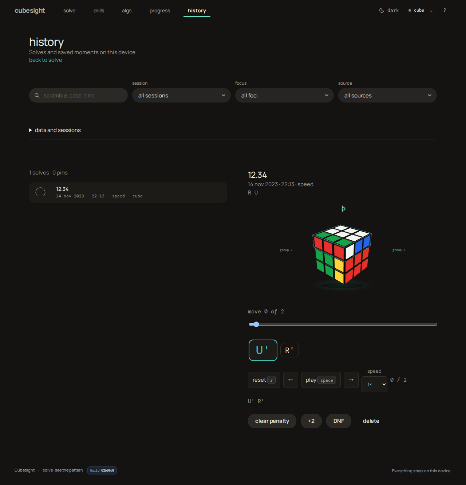

The history route now uses the approved filled filters, search, mini-Orbit solve rows weighted by recorded move timing, and quiet-fill actions. This frame documents the implementation; no new design decision is requested.

