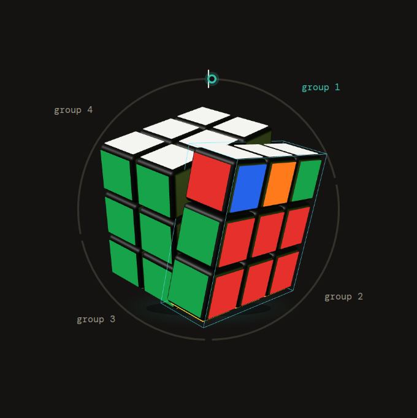
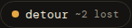
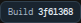

F16 steps 1-3: a crawl of the running app (Orbit dark, 1440x900 and 390x844) catalogued every widget instance, grouped them into families and gave each look an ID. The full registry, with counts, where each variant is used, the CSS source files and the computed styles, is `docs/design/WIDGETS.md`; the raw data is `inventory.json` next to this post. Nothing in the app was changed.

**Numbers.** 24 app routes and 6 dev routes (plus the states reached through the fake cube: connecting, a failed connect, the device menu, settings, a guided scramble with a wrong turn, inspection, solving, results, the review detail, the debug drawer, help, the timer running, history with a past solve and its replay, the review page) gave 520 distinct style signatures, folded into **31 families and 252 variants** (a variant is one class and look; the image IDs below follow `W-<family><letter>`, for example `W-06c` is the settings option pills). In the 28 non-approved families with more than one variant, **208 variants are redundant** (variants beyond the first). **18 variants break a binding rule** from the fleet spec.

## The families

| ID | Family | Variants | Status |
|---|---|---|---|
| W-01 | Header | 6 | approved |
| W-02 | Orbit | 2 | approved |
| W-03 | Cube (canvas plus 5 stage frames) | 8 | approved |
| W-04 | Buttons | 23 | proposed |
| W-05 | Chips and pills | 8 | proposed |
| W-06 | Segmented controls | 6 | proposed |
| W-07 | Toggles and checkboxes | 10 | proposed |
| W-08 | Selects | 14 | proposed |
| W-09 | Text inputs | 10 | proposed |
| W-10 | Cards and panels | 9 | proposed |
| W-11 | List rows | 8 | proposed |
| W-12 | Tables | 8 | proposed (3 to remove) |
| W-13 | Tabs and sub-nav | 7 | proposed (3 to remove) |
| W-14 | Drawers and side panels | 2 | proposed |
| W-15 | Dialogs and sheets | 5 | proposed |
| W-16 | Toasts and status lines | 20 | proposed |
| W-17 | Key hints and keycaps | 8 | proposed |
| W-18 | Badges and tags | 4 | proposed |
| W-19 | Stat blocks and counters | 6 | proposed |
| W-20 | Coach line | 3 | proposed |
| W-21 | Scramble and move display | 13 | proposed |
| W-22 | Timer display | 5 | proposed (1 to remove) |
| W-23 | Round and progress panels | 8 | proposed (4 to remove) |
| W-24 | Charts | 7 | proposed (1 to remove) |
| W-25 | Empty states | 4 | proposed |
| W-26 | Links and crumbs | 13 | proposed |
| W-27 | Device chip and menu | 6 | pending (2 to remove) |
| W-28 | Answer and choice buttons | 5 | proposed |
| W-29 | Disclosures | 7 | proposed |
| W-30 | Eyebrows, captions, section heads | 14 | proposed |
| W-31 | Footer | 3 | to-remove |

## Worst duplication hotspots

1. **Buttons, 23 variants** (W-04a to W-04w). The same primary/secondary/text roles are drawn by `primary-button`, `text-button`, `b-textbtn`, `b-btn`, `b-start`, `sr-primary`, `sr-secondary`, `tm-textbtn`, `pll-text-button`, `skip-button`, `pll-skip`, `new-case-button` and about eight classless buttons styled from their container (reset/start, quick-round presets, review step buttons). Heights alone range from 25 to 48 px.
2. **Status and hint lines, 20 variants** (W-16). Nearly every page has its own hint paragraph (`cp-hint`, `oll-hint`, `lookahead-hint`, `progress-caption`, `rp-note`, `timing-note`, `b-settings-caption`, `g-note` ...), at font sizes from 8 to 16 px.
3. **Eyebrows and section heads, 14 variants** (W-30): `eyebrow`, `alg-eyebrow`, `cs-eyebrow`, `g-eyebrow`, `hub-eyebrow`, `b-ores-eyebrow` and `b-rev-eyebrow` are the same small caps label in seven looks.
4. **Selects, 14 variants** (W-08), including the 0.5x/1x/2x/4x speed select in four styles (timer, sequence player, history, move guide) and five `rp-*` selects in a different style from every other select.
5. **Move display, 13 variants** (W-21): `mg-strip`, `mg-guide`, `b-moves`, `b-recovery-moves`, `b-rev-dmoves`, `history-scramble`, the move chips `b-rev-mv` and `sr-moment`, plus four separate counters ("21 / 21", "move 0 of 2", "scramble 1 / 51").
6. **Pill-shaped controls: chips (8), segmented (6) and toggles (10)** (W-05, W-06, W-07). Four segmented controls (`.segmented`, `.pll-segmented`, `.b-opt`, `.tm-opt`) do the same job, and the toggles come as native checkboxes, `b-cfg` text toggles and labelled switches.
7. **Links, 13 variants** (W-26) and **cards, 9 variants** (W-10, e.g. `alg-case-card`, `progress-card`, `g-card`, `hub-continue`, `studio-panel`).
8. **The frames around the Cube** (W-03): five different stage containers (`cube-stage`, `hub-hero-stage`, `progress-hero-stage`, `pll-cube-stage`, `studio-stage`) with different backgrounds and radii.
9. **Keycaps, 8 variants** (W-17): `kbd` is restyled by every button or row it sits in (answer buttons, face pickers, the start button, the close button).
10. **Rule violations** (below).

## Variants that break the binding rules

- **Progress bars and lines (#1):** the split bars `b-ch-bar` (results), `progress-day` (progress page), `pll-mini-track` (PLL trainer). The corner trainer's `progress-track` was not on screen in the crawled states.
- **Split tables duplicating the Orbit (#1/#2):** `b-oring-row` and `b-oring-aside` (the rows beside the ring) and `b-ch-splits` (the split rows under the results).
- **One-off rings and charts:** the inspection dial `b-oinsp`, the manual timer pad `tm-pad` (own dial and zones), the TPS line `b-ch-tps`.
- **Footer (#12):** `footer`, its dot separator and the `build-badge`, on all 24 app routes.
- **Per-page connect buttons (#14):** `b-start` "connect cube", `b-connect` and the dev studio's "connect cube" button, next to the real device chip (W-27).
- **A second nav (#17):** the brain page's in-page tab bar (`b-top`, `b-tabs`, `b-tab`) repeats the header nav.

## Images

Every other image is listed below by its variant ID. `-2` and `-3` suffixes are other states or sizes of the same variant. A few variants share pixels with another (so have no image of their own), and elements whose screenshot failed in the crawl are noted in `inventory.json` under `crawlNotes`.

## Next (F16 step 4)

Propose one consolidated design per family, in the orbit-v3 A language, as numbered posts; start with the biggest wins: buttons (W-04), the pill family (W-05 to W-07), status lines (W-16) and the keycap (W-17). Approved ones become shared components and the duplicates are migrated and deleted.
